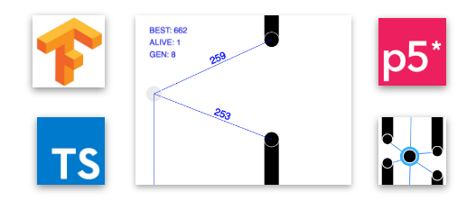

# FlappyBird AI

[](https://atipezda.github.io/FlappyBird_Machine_learning/index.html)

# DEMO: [Flappybird AI](https://atipezda.github.io/FlappyBird_Machine_learning/index.html)

# Tech stack:

  - TensorFlow.js
  - p5.js
  - Typescript
  - [Gaweph/p5-typescript-starter](https://github.com/Gaweph/p5-typescript-starter) 

# Installation

### DEV
requires [Node.js](https://nodejs.org/) v4+ to run.

Install the dependencies and devDependencies and start the server.

```sh
$ git clone https://github.com/atipezda/FlappyBird_Machine_learning.git
$ cd FlappyBird_Machine_learning
$ npm install
$ npm run start
```

### PROD

```sh
$ git clone https://github.com/atipezda/FlappyBird_Machine_learning.git
$ cd FlappyBird_Machine_learning
# OPEN index.html in browser
```


# Configuration
feel free to change this variables
*sketch/seketch.ts*
```ts
const birdsAmount = 250;
const autoKill = false;    
```


License
----

MIT


**Free Software, Hell Yeah!**
